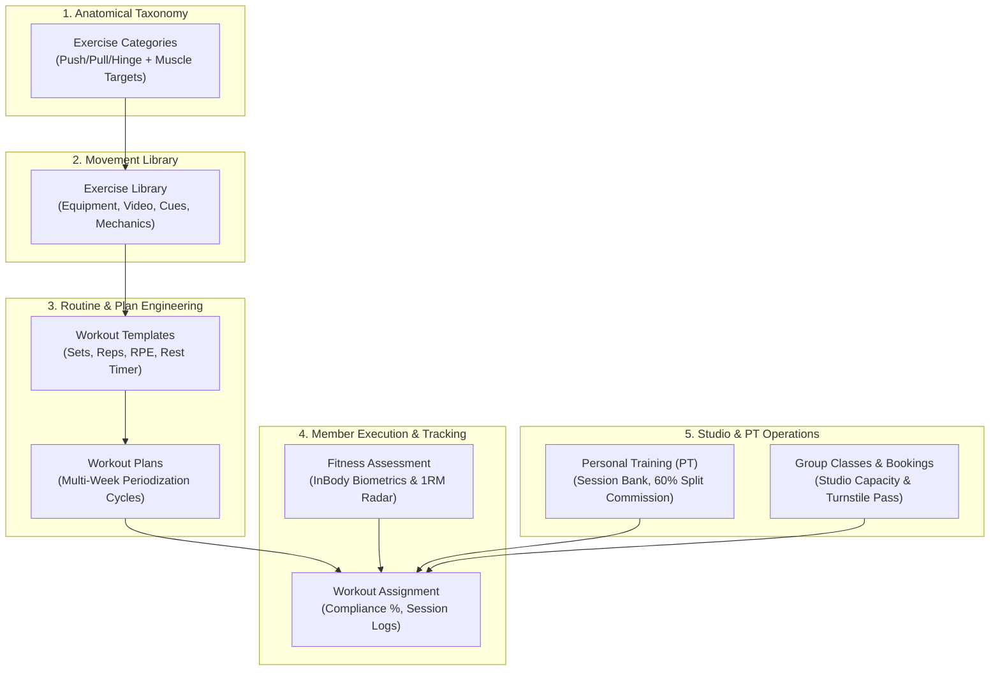
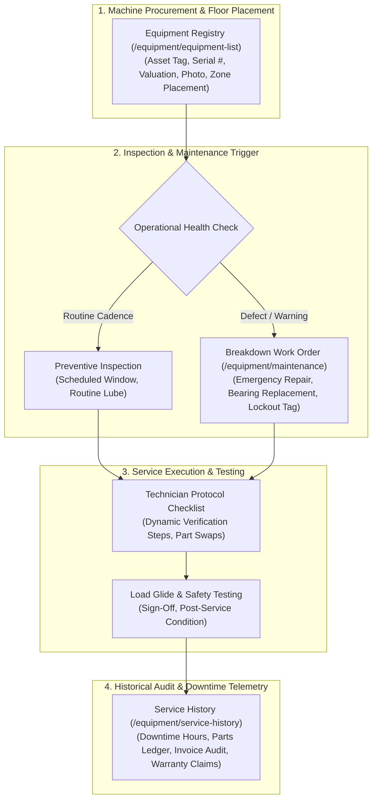
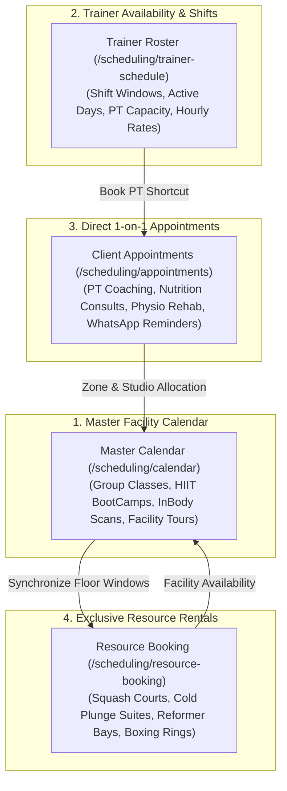
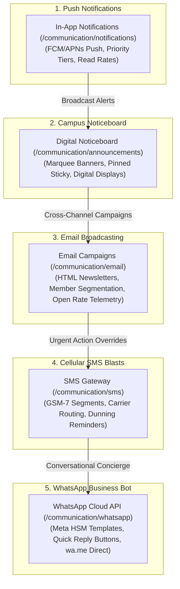
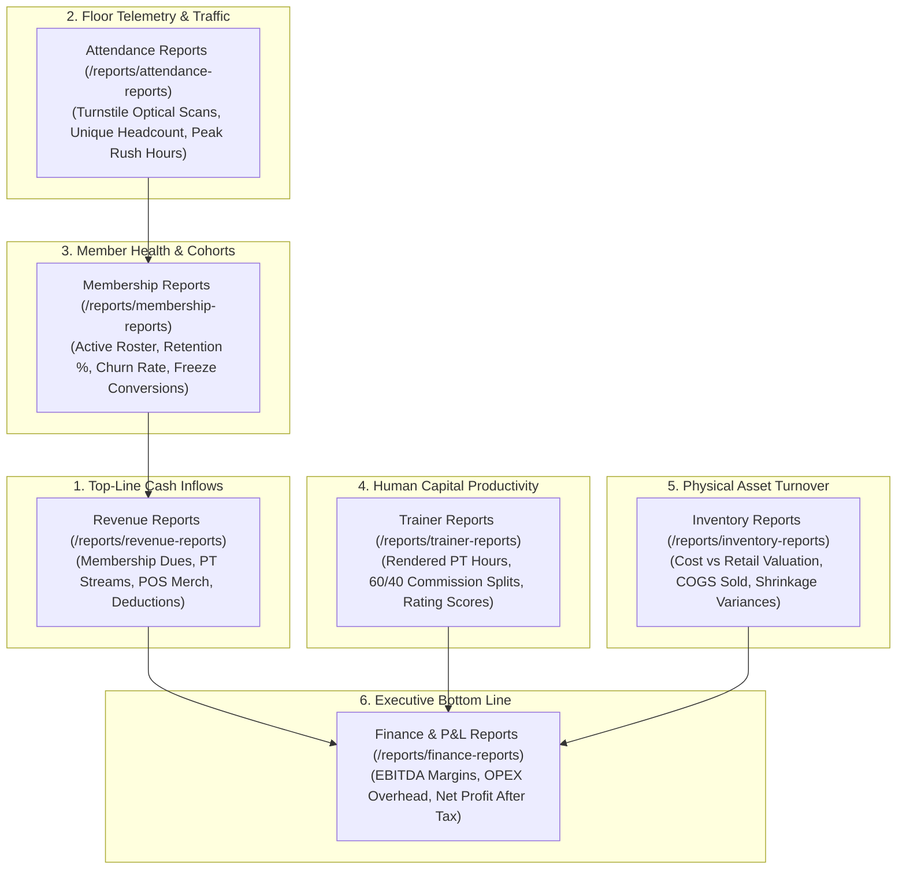
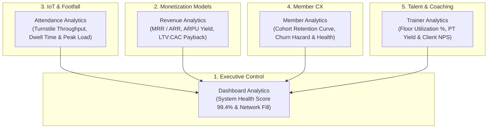
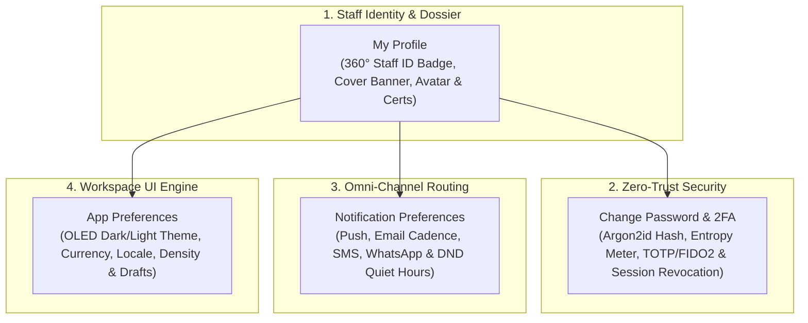
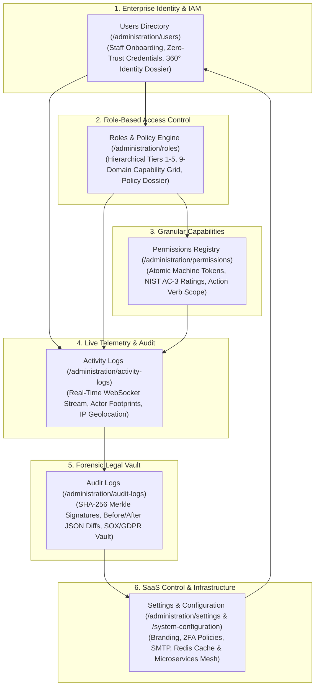

# GymFlow ERP — Enterprise Multi-Tenant Gym Management SaaS

[](https://www.typescriptlang.org/)
[](https://reactjs.org/)
[](https://vitejs.dev/)
[](https://tailwindcss.com/)
[](https://nodejs.org/)
[](https://expressjs.com/)
[](https://mongoosejs.com/)

**GymFlow ERP** is a commercial-grade, multi-tenant SaaS Enterprise Resource Planning platform for modern fitness clubs, gym chains, and boutique studios. Designed with an original luxury design language inspired by **Linear, Stripe, Vercel, and Supabase**, GymFlow ERP provides end-to-end management from physical access turnstiles and biometric check-ins to automated billing, POS cash registers, inventory tracking, trainer scheduling, and workout protocols.

---

## 🏛️ Monorepo Architecture

```
gymflow-erp/
├── apps/
│   ├── web/                     # Frontend Application (@gymflow/web)
│   │   ├── app/
│   │   │   ├── core/            # Auth Store, Theme System, Tokens, Config
│   │   │   ├── modules/         # 16 Business Domains & 84 Modular Submodules
│   │   │   ├── shared/          # Reusable UI Primitives, Layouts, Charts & DataTables
│   │   │   ├── router/          # AppRouter with ProtectedRoute & Code-Splitting
│   │   │   └── main.tsx         # Frontend React bootstrap
│   │   ├── index.html
│   │   ├── vite.config.ts       # Vite configuration with @tailwindcss/vite
│   │   └── package.json
│   │
│   └── api/                     # Backend Application (@gymflow/api)
│       ├── src/
│       │   ├── config/          # App, Database, Redis, Mail, Storage, Security configs
│       │   ├── core/            # Auth, JWT, Winston Logger, Middleware, RBAC, Storage
│       │   ├── database/        # Mongoose connection, BaseModel, BaseRepository
│       │   ├── shared/          # BaseController, BaseService, BaseResponse, BaseValidator
│       │   ├── domains/         # 14 Business Domains & 74 Standardized Submodules
│       │   ├── routes/          # Central Domain Router with Auth & Multi-Tenant guards
│       │   ├── app.ts           # Express Application configuration
│       │   └── server.ts        # HTTP bootstrap server
│       ├── docs/                # Architecture.md, BackendGuide.md, APIStandards.md
│       └── package.json
│
├── package.json                 # Monorepo Workspace Configuration
└── README.md                    # Root Workspace Documentation
```

---

## 🚀 Tech Stack

### Frontend (`apps/web`)
- **Core**: React 18, TypeScript (Strict Mode), Vite 5
- **Design System & Styling**: Tailwind CSS v4, CSS Variables, Design Tokens, Custom Glassmorphism
- **Component Primitives**: Radix UI (`@radix-ui/react-*`), Lucide Icons (`lucide-react`)
- **Media & Asset Uploader**: Unified Drag-and-Drop `ImageUpload` component with instant Base64 data conversion, variant styling (`avatar`, `thumbnail`, `banner`, `card`), size guards, replace & remove actions
- **State Management & Data**: Zustand 4, TanStack Query v5, TanStack Table v8
- **Visual Analytics**: Recharts (Area, Bar, Donut, Gauge charts)
- **Forms & Validation**: React Hook Form, Zod
- **Command & Shortcuts**: CMDK Global Command Palette (`Ctrl + K` / `Cmd + K`)
- **Notifications**: Sonner Rich Toast Engine

### Backend (`apps/api`)
- **Runtime**: Node.js LTS, Express 4, TypeScript
- **Database & Modeling**: MongoDB, Mongoose 8 (Repository Pattern, Soft Deletes, Multi-Tenant Scoping)
- **Security & Authentication**: JWT (Access & Refresh Tokens), bcrypt, Helmet, CORS
- **Logging & Auditing**: Winston structured JSON logger, Morgan HTTP middleware
- **Async Processing & Queues**: Redis (prepared), BullMQ (prepared)
- **File Storage**: Local filesystem, AWS S3 (prepared), Cloudinary (prepared)

---

## 🏢 Business Domains & Implemented Modules

GymFlow ERP features **16 full-scale business domains** containing **84 specialized submodules**:

| # | Domain | Submodules | Key Features & Live Status |
| :--- | :--- | :--- | :--- |
| **1** | **Authentication** | `login`, `register`, `forgot-password`, `reset-password`, `otp` | 🟢 JWT access/refresh rotation, demo quick-fill logins, session guard |
| **2** | **Dashboard** | `admin-dashboard`, `reception-dashboard`, `trainer-dashboard`, `member-dashboard`, `nutrition-dashboard` | 🟢 Real-time MRR revenue charts, hourly capacity check-ins, class schedules |
| **3** | **Administration** | `users`, `roles`, `permissions`, `branches`, `audit-logs`, `settings` | 🟢 Multi-branch management, RBAC matrix, system preferences, audit trail |
| **4** | **Gym Management** | `gym-profile`, `branches`, `staff`, `facilities`, `zones`, `lockers`, `turnstiles`, `access-control`, `operating-hours` | 🟢 Multi-gym network switcher, 360° gym profile, trainer/staff biometric shift telemetry & document vault, branch onboarding |
| **5** | **Member Management** | `members`, `memberships`, `renewals`, `freezes`, `transfers`, `attendance` | 🟢 360° Salesforce-style profile, membership freezing, biometric attendance |
| **6** | **Finance & Billing** | `invoices`, `payments`, `pos`, `discounts`, `expenses`, `salary`, `taxes` | 🟢 Tax invoice generator, 360° printable tax receipt, interactive POS register, live Stripe/Card checkout |
| **7** | **Inventory & POS** | `products`, `categories`, `inventory-stock`, `suppliers`, `purchases`, `stock-adjustment` | 🟢 Product catalog (Supplements, Apparel, Merch), stock alerts, vendor management, quick restock modal |
| **8** | **Fitness & Workouts** | `exercises`, `workout-plans`, `routines`, `assigned-workouts`, `progress-tracking`, `body-composition` | 🟢 Exercise library, hypertrophy/cardio routines, 1RM calculator, BMI tracking |
| **9** | **Nutrition** | `meals`, `diet-plans`, `macros`, `supplements`, `assigned-diets`, `hydration` | 🟢 Calorie and macronutrient calculators, custom meal protocols, supplement plans |
| **10** | **CRM & Leads** | `leads`, `trials`, `follow-ups`, `pipeline`, `campaigns`, `feedback` | 🟢 Sales Kanban pipeline, trial class bookings, automated follow-up reminders |
| **11** | **Equipment** | `equipment-list`, `maintenance`, `vendors`, `warranty`, `inspections` | 🟢 Machine telemetry, preventive maintenance schedules, repair work orders |
| **12** | **Scheduling** | `classes`, `trainers`, `calendar`, `bookings`, `room-allocation`, `waitlist` | 🟢 Visual timetable, trainer private booking, waitlist auto-fill |
| **13** | **Communication** | `announcements`, `notifications`, `sms`, `email-templates`, `chat`, `push` | 🟢 Broadcast SMS/Email, automated renewal alerts, real-time staff messaging |
| **14** | **Reports** | `revenue-reports`, `attendance-reports`, `membership-reports`, `trainer-reports`, `tax-reports` | 🟢 Exportable financial summaries, PDF generation, CSV data dumps |
| **15** | **Analytics** | `member-analytics`, `revenue-forecasts`, `retention-analytics`, `class-popularity` | 🟢 Cohort retention analysis, churn prediction, room utilization heatmaps |
| **16** | **Profile & Security** | `my-profile`, `profile-change-password`, `profile-notifications`, `profile-preferences` | 🟢 Personal 360° staff ID badge, Argon2id & TOTP 2FA rotation, omni-channel dispatch matrix, dark OLED visual engine |

---

## 🌟 Highlight Modules in Focus

### 1. Finance & Billing (`/finance`)
- **Invoice Directory (`/finance/invoices`)**: Search, filter, and review invoices with itemized pricing, tax calculation, and payment status badges (`PAID`, `PENDING`, `OVERDUE`).
- **3-Step Invoice Generator (`/finance/invoices/create`)**:
  1. *Member Selection*: Live member query or walk-in guest assignment.
  2. *Itemized Charges*: Dynamic plans, PT packs, discount coupons, and auto 8% tax calculation.
  3. *Payment Terms*: Credit Card, Stripe, Cash, or Wire Transfer settlements.
- **360° Digital Tax Receipt (`/finance/invoices/:id`)**: Printable receipt with GymFlow enterprise branding, itemized table, TLS security badge, and 1-click browser print dialog.
- **Point of Sale (POS) Cash Register (`/finance/pos`)**: High-speed touch cash register with category tabs (Passes, Supplements, Merch, Drinks), real-time cart ledger, and 1-click MongoDB settlement.

### 2. Inventory & Stock Management (`/inventory`)
- **Product Catalog (`/inventory/products`)**: Live MongoDB product directory with category filters, retail price vs. cost margins, SKU/barcode lookup, and low-stock alerts.
- **Quick Restock & Supplier Link**: Instant restocking dialog with vendor invoice reference tracking.
- **Stock Ledger & Adjustments (`/inventory/inventory-stock`, `/inventory/stock-adjustment`)**: Real-time balance calculations, unit tracking, and write-off audits.

### 3. Member Management (`/member-management`)
- **360° Member Directory (`/member-management/members`)**: Member profiles with active membership badges, renewals, attendance history, and custom form controls (DatePicker, Select, Popovers).

### 4. Multi-Gym & Branches Network (`/gym-management/branches`)
- **Global Top Navigation Gym Switcher**: Dynamic facility selector in the top navbar (`Downtown Flagship`, `Westside Performance`, `Uptown Wellness`, `Eastside Boxing`, `Consolidated All Locations`) that updates the active workspace context in real-time.
- **Multi-Gym Directory (`/gym-management/branches`)**: Live network KPI ribbon (`4 Facilities`, `89,500 sq ft`, `3,230 Members`, `$391k/mo revenue`), live capacity occupancy meters, General Manager assignments, and 1-click active location switching.
- **2-Cards-per-row Branch Onboarding (`/gym-management/branches/create`)**: Responsive onboarding form with facility facade photo uploader, physical address, specs, turnstile count, and operational schedules.
- **360° Branch Telemetry (`/gym-management/branches/:id`)**: Comprehensive branch dashboard with live occupancy gauges, amenities breakdown, operating schedules, and manager contact cards.

#### 🏢 Multi-Gym & Chain Management Architecture:
* **Active Branch Scoping (`useBranchStore`)**: When an admin selects a specific gym branch (e.g. *Westside Performance Club*), all 16 ERP modules (Staff, Members, Shifts, Holidays, Working Hours, POS, Invoices, Dashboards) automatically scope down to that location.
* **Consolidated HQ Mode (`ALL`)**: Chain owners and Super Admins can select *"Consolidated All Locations"* to monitor the entire gym network at once ($391k/mo aggregate revenue, 3,230 active members, 89,500 sq ft). Data tables display location badges (`Downtown Flagship`, `Westside`, `All Locations`) for network-wide auditing.
* **Dynamic Branch Provisioning**: Owners can click **"+ Onboard New Gym Branch"** anytime to provision a 5th, 6th, or 10th gym with custom geofencing, turnstile lanes, operating timetables, and leadership leads. Newly onboarded branches automatically register into the top navigation switcher.
* **Staff Roaming & Floating Assignments**: Trainers and staff can be locked to a single gym campus or assigned as **"Floating / Network-Wide" (`ALL`)** (e.g., Regional Operations Leads, Nutritionists).
* **Member All-Access Passports**: Members can hold single-gym memberships or All-Access passports permitting biometric entry across all turnstile gates in the chain.

### 5. Dedicated 360° Gym Profile (`/gym-management/gym-profile`)
- **Enterprise Club Dashboard**: Hero facade cover with club logo, verified status badge, live occupancy meters, and GPS geofence coordinates.
- **5 Interactive Telemetry Tabs**:
  1. *Training Zones & Amenities*: Detailed breakdown of athletic bays, powerlifting alleys, sprint turf, saunas, and cold plunges.
  2. *Location & Contact Endpoints*: Physical address, front desk lines, emergency hotlines, and official web links.
  3. *Operational Schedule*: Weekdays, Saturday, Sunday, and holiday operating hours.
  4. *Billing & Tax Configuration*: Base currency, sales tax percentage, and business tax EIN.
  5. *Access Control & Safety*: RFID/Biometric turnstiles, gate lane counts, and inspected AED defibrillator status.

### 6. Trainers & Staff Management (`/gym-management/staff`)
- **Clean Table Directory (`/gym-management/staff`)**: Roster table with coach specializations, shift timings, hourly rates, client ratings, and live branch filtering.
- **360° Staff Profile Dashboard (`/gym-management/staff/:id`)**:
  - *Assigned Members Roster*: Live roster of training clients assigned to each coach.
  - *Shift Attendance & Biometric Clock-In*: Live biometric turnstile telemetry with manual clock-in/out button.
  - *Document Vault*: Drag-and-drop PDF contract, certification, and identity document upload with instant preview.
- **2-Cards-per-row Responsive Onboarding & Edit (`/gym-management/staff/create`, `/edit`)**: Full-page forms with instant photo file uploaders and interactive form controls.

### 7. Department & Operational Divisions (`/gym-management/departments`)
- **Department Network Directory (`/gym-management/departments`)**: 6 core fitness divisions (`Fitness & PT`, `Front Desk`, `Studio Programming`, `Nutrition & Spa`, `Operations`, `Corporate Sales`) with KPIs for headcount, operating budgets, and utilization.
- **360° Department Hub (`/gym-management/departments/:id`)**:
  - *Interactive Staff Assignment Modal*: Assign existing staff directly from employee roster with shift allocations without leaving the page.
  - *Remove Staff Verification Modal*: Safe removal confirmation dialog when unassigning staff from a department.

### 8. Fitness & Workouts Domain (`/fitness`)

The **Fitness & Workouts Domain** is engineered as a **connected 9-layer training hierarchy**. Instead of disconnected lists, every submodule feeds directly into the next—progressing from anatomical taxonomy up to individual member execution, biometric tracking, and studio admissions:



#### 🏋️ Submodule Breakdown & How Each Works:

1. **Exercise Categories (`/fitness/exercise-categories`)**:
   - *Role*: Anatomical classification engine.
   - *Workflow*: Organizes training by Primary Muscle Groups (*Chest, Back, Legs, Shoulders, Arms, Core, Mobility*) and Biomechanical Movement Patterns (*Horizontal Push, Vertical Pull, Knee-Dominant Squat, Hip Hinge, Loaded Carry*).
   - *360° Hub*: Movement catalog list, target muscle highlight badges, and branch scoping (*HQ vs. Branch-specific*).

2. **Exercise Library (`/fitness/exercise-library`)**:
   - *Role*: Gym master movement vault and coaching dictionary.
   - *Workflow*: Each movement is linked to an Exercise Category with equipment type (*Barbell, Dumbbell, Cable, Machine, Kettlebell, Bodyweight*), difficulty, and mechanics (*Compound vs. Isolation*).
   - *360° Hub*: Step-by-step coaching cues, video demonstrations, calorie burn rate, common technique mistakes, and 1RM club leaderboard.

3. **Workout Templates (`/fitness/workout-templates`)**:
   - *Role*: Single-session routine recipes built by coaches.
   - *Workflow*: Assembles exercises from the Exercise Library into a structured routine (e.g., *Push Day A: Hypertrophy & Upper Chest*).
   - *360° Hub*: Exercise timeline breakdown with Sets, Reps range, Rest timers in seconds, and RPE intensity targets (1–10).

4. **Workout Plans (`/fitness/workout-plans`)**:
   - *Role*: Multi-week macro periodization curriculum.
   - *Workflow*: Stacks multiple Workout Templates across 4, 8, 12, or 16-week periodization phases (*Volume Accumulation &rarr; Progressive Overload &rarr; Peaking / Deload*).
   - *360° Hub*: Multi-week phase roadmaps, target goals, and enrolled athletes compliance tracking.

5. **Workout Assignment (`/fitness/workout-assignment`)**:
   - *Role*: Member onboarding, program prescription, and compliance engine.
   - *Workflow*: Assigns a Workout Plan or Custom Template to an active gym member and pairs them with a supervising head coach.
   - *360° Hub*: Progress completion meters (e.g. *42/60 completed*), adherence percentage (e.g. *95% compliance*), past workout logs, and delinquent member alerts.

6. **Fitness Assessment & InBody Biometrics (`/fitness/fitness-assessment`)**:
   - *Role*: Biological feedback and physical progress tracking.
   - *Workflow*: Records InBody bioelectrical impedance telemetry (Body Weight, Body Fat %, Skeletal Muscle Mass, Visceral Fat Level).
   - *360° Hub*: Big 3 Strength benchmarks (*Bench Press 1RM, Squat 1RM, Deadlift 1RM*), VO2 Max cardio scoring, and posture screen notes.

7. **Personal Training Packages & Roster (`/fitness/personal-training`)**:
   - *Role*: 1-on-1 coaching contracts and trainer financial commissions.
   - *Workflow*: Manages session credit banking (e.g., *Tier 20: 4 completed, 16 remaining*).
   - *360° Hub*: Hourly rates, trainer direct commission splits (60% coach / 40% facility), financial contract ledger, and rendered session history.

8. **Group Classes & Studio Programming (`/fitness/group-classes`)**:
   - *Role*: Studio timetable and spot capacity management.
   - *Workflow*: Schedules studio class formats (*HIIT, Spinning, Boxing, Power Pilates, Yoga Flow*) with lead instructors and max spot limits.
   - *360° Hub*: Real-time room spot capacity meters (*22/24 Booked – 92% Rush*), timetable details, and confirmed member roster.

9. **Class Bookings & Digital Pass (`/fitness/class-booking`)**:
   - *Role*: Spot allocation and attendance check-in.
   - *Workflow*: Allocates reserved bike/mat spots (e.g., *Bike #14 / Mat #08*) with waitlist queueing.
   - *360° Hub*: Generates Digital Admission QR / RFID Pass for fast turnstile check-in with 1-click attendance check-in simulation.

### 9. Shift Management (`/gym-management/shift-management`)
- **Shift Template Directory (`/gym-management/shift-management`)**: Morning Open, Mid-Day, Evening Peak, and Weekend shifts with minimum headcount quotas and overtime pay multipliers.
- **360° Shift Telemetry Hub (`/gym-management/shift-management/:id`)**:
  - *Staff Roster Assignment*: Interactive modal to assign coaches and staff directly from employee dropdown.
  - *Weekly Schedule Matrix*: 7-day schedule grid with duration calculations and break times.
  - *Attendance Grace Periods*: 15-minute biometric check-in leniency and turnstile attendance compliance telemetry (99.4%).

### 10. Holidays & Facility Closures (`/gym-management/holidays`)
- **Holiday Calendar (`/gym-management/holidays`)**: National holidays, maintenance shutdowns, and reduced operating schedules.
- **360° Holiday Overview Hub (`/gym-management/holidays/:id`)**:
  - *Access Modes*: Full Facility Closed, Reduced Operating Hours, or 24/7 Keycard / Self-Service Turnstiles.
  - *Class & PT Automation*: Automated group fitness cancellation rules and member wallet pass refunds.
  - *Announcement Broadcast*: Real-time push notification and banner alerts for gym members.

### 11. Facility Working Hours & Zone Schedules (`/gym-management/working-hours`)
- **Zone Operating Timetables (`/gym-management/working-hours`)**: Master timetable matrix for Free Weights Floor, Spa & Recovery Wet Lounge, 25m Lap Pool, and Smoothie Bar.
- **360° Zone Telemetry Hub (`/gym-management/working-hours/:id`)**:
  - *24/7 Access Areas*: Biometric RFID access toggles for heavy iron and powerlifting alleys.
  - *Peak Surge Windows*: Occupancy limits and capacity rush hour tracking (05:30 PM - 08:30 PM).
  - *Maintenance Overrides*: Scheduled nightly sanitization windows.

---

### 12. CRM & Sales Conversion Ecosystem (`/crm`)

The **GymFlow CRM & Growth Marketing Domain** is engineered as a unified 7-layer customer acquisition and revenue acceleration engine. It coordinates the entire prospect lifecycle—from top-of-funnel marketing campaigns and peer advocate referrals to reception tours, VIP trial passes, automated cadences, and 1-click member enrollment.
#### 🔄 Complete End-to-End CRM Sales Lifecycle Flow:

#### 🔄 Standardized Architecture & Data Rules:
* **Dual Persistence Layer**: All 7 CRM submodules load and merge data from isolated `localStorage` keys (`gymflow_custom_leads`, `gymflow_custom_trial_members`, `gymflow_custom_visitors`, `gymflow_custom_follow_ups`, `gymflow_custom_tasks`, `gymflow_custom_campaigns`, `gymflow_custom_referrals`) with fallback to the backend API (`/api/v1/crm/*`), ensuring **100% instant UI updates and seamless CRUD operations without any backend downtime**.
* **Unified Image & Asset Upload**: Every module uses the standard `<ImageUpload variant="avatar" | "banner" />` component with drag-and-drop file picking, instant client-side Base64 conversion, and replace/remove actions.
* **1-Click Cross-Module Handover**: Converting a lead, trial member, or referral friend automatically pre-populates the destination form (e.g. `/member-management/members/create`) with avatar, full name, phone number, and email.

---

#### 📦 Detailed Submodule Breakdown & Step-by-Step Flow:

1. **Leads & Sales Pipeline (`/crm/leads`)**:
   - **Role**: Master CRM pipeline and prospect management.
   - **Intake Form (`/crm/leads/create`)**: Multi-card intake with `<ImageUpload variant="avatar" />`, contact channels, budget calculator, dynamic estimated Lifetime Value (LTV), acquisition source, and preferred workout time windows.
   - **Directory & Pipeline Board (`/crm/leads`)**: 4 MetricCards (`TOTAL PIPELINE`, `HIGH INTENT (HOT)`, `WON MEMBERS`, `PIPELINE LTV VALUE`), quick stage filter chips (`ALL`, `NEW_INQUIRY`, `TOUR_SCHEDULED`, `TRIAL_ACTIVE`, `NEGOTIATION`, `WON_MEMBER`), 1-click WhatsApp dialer, and 1-click **"Convert to Member"** button.
   - **360° Lead Dossier (`/crm/leads/:id`)**: Avatar banner, direct action triggers (`Message on WhatsApp`, `Schedule Tour`, `Issue VIP Trial Pass`, `Convert to Member`), 4 telemetry cards, and discovery notes.

2. **VIP Trial Members & Access Passes (`/crm/trial-members`)**:
   - **Role**: Manages prospective members experiencing the club on temporary VIP access.
   - **Pass Provisioner (`/crm/trial-members/create`)**: `<ImageUpload variant="avatar" />`, pass tier quotas (`1_DAY_PASS`, `3_DAY_TRIAL`, `7_DAY_EXPERIENCE`, `WEEKEND_WARRIOR`), expiration scheduler, and host personal trainer assignment.
   - **Pass Directory (`/crm/trial-members`)**: 4 MetricCards (`TOTAL VIP PASSES`, `ACTIVE ON-FLOOR PASSES`, `TURNSTILE CHECK-INS`, `CONVERSION RATE`), live **`+1 Log Turnstile Entry`** counter with visual usage progress bar, and 1-click **"Convert to Member"** action.
   - **360° VIP Passport Dossier (`/crm/trial-members/:id`)**: High-res QR pass badge, turnstile entry telemetry, assigned coach, and included amenities list.

3. **Visitors & Facility Tours (`/crm/visitors`)**:
   - **Role**: Reception walk-in log and guided facility tour manager.
   - **Visitor Intake (`/crm/visitors/create`)**: Front desk intake with `<ImageUpload variant="avatar" />`, visit purpose selector, host representative assignment, digital safety waiver checkbox, and badge numbering.
   - **Visitor Log Directory (`/crm/visitors`)**: 4 MetricCards (`TOTAL GUESTS`, `ON PREMISES NOW`, `FACILITY TOURS HOSTED`, `DIGITAL WAIVER RATE`), 1-click **`Complete Tour`** status toggle, and 1-click **`To Lead`** pipeline converter.
   - **360° Visitor Dossier (`/crm/visitors/:id`)**: Badge telemetry, check-in/out timestamps, liability compliance verification, and tour observation notes.
4. **Automated Follow-Ups & Cadences (`/crm/follow-ups`)**:
   - **Role**: Multi-channel outreach cadence and lead nurturing queue.
   - **Cadence Scheduler (`/crm/follow-ups/create`)**: Outreach planner with `<ImageUpload variant="avatar" />`, channel selector (`WhatsApp`, `Phone`, `SMS`, `Email`, `In-Person`), scheduled date/time, urgency priority, and call script talking points.
   - **360° Cadence Dossier (`/crm/follow-ups/:id`)**: Call script notes, outreach history timeline, and representative ownership.
   - **Advocate Network Directory (`/crm/referrals`)**: 4 MetricCards (`TOTAL ADVOCATE REFERRALS`, `CONVERTED MEMBERS`, `PENDING REWARDS PAYOUT`, `ADVOCATE WIN RATE`), member-to-friend relationship flow, 1-click `Message Friend`, 1-click `Approve Reward`, and CSV export.
   - **360° Referral Dossier (`/crm/referrals/:id`)**: Dual connection card with tracking code, 1-click `Approve Reward` button, and 1-click `Enroll Friend as Member` routing.

---

- **Unified Media Uploader**: Reusable `<ImageUpload variant="avatar" | "banner" | "thumbnail" | "card" />` component with drag-and-drop, instant file reader, and clear/replace actions.

GymFlow ERP comes with built-in enterprise demo profiles across both platform and tenant tiers:

| Persona & Role | System Key | Hierarchy | Demo Email | Password | Access Scope & Dedicated Dashboard |
| :--- | :--- | :--- | :--- | :--- | :--- |
| **Platform Super Admin** | `SUPER_ADMIN` | Level 0 | `platform@gymflow.io` | `password123` | Root multi-tenant cloud controller (`/platform-admin/login`) |
| **Gym Administrator / Owner** | `ADMIN` | Tier 1 | `ahmad@gmail.com` | `password123` | Root tenant authority across all 10 modules (`/dashboard/admin-dashboard`) |
| **Branch General Manager** | `BRANCH_MANAGER` | Tier 2 | `manager@gymflow.io` | `password123` | Campus leadership across 6 operational modules (`/dashboard/admin-dashboard`) |
| **Finance & Billing Officer** | `ACCOUNTANT` | Tier 3 | `finance@gymflow.io` | `password123` | Invoices, POS register, payroll, and revenue BI (`/dashboard/accountant-dashboard`) |
| **Fitness Coach & Trainer** | `TRAINER` | Tier 3 | `trainer@gymflow.io` | `password123` | Exercise library, workout routines, and PT clients (`/dashboard/trainer-dashboard`) |
| **Front Desk & Concierge** | `RECEPTIONIST` | Tier 3 | `reception@gymflow.io` | `password123` | Turnstiles, check-ins, classes, and day guests (`/dashboard/reception-dashboard`) |
| **Certified Nutritionist** | `NUTRITIONIST` | Tier 3 | `nutrition@gymflow.io` | `password123` | Meal catalog, macros, hydration, and diets (`/dashboard/nutrition-dashboard`) |
| **Gym Member (Self-Service)** | `MEMBER` | Tier 4 | `member@gymflow.io` | `password123` | Personal workouts, prescribed diets, and class booking (`/dashboard/member-dashboard`) |

---

- **MongoDB**: Local instance (`mongodb://127.0.0.1:27017/gymflow_erp`) or MongoDB Atlas

### 2. Installation
```bash
# Clone the repository
git clone https://github.com/your-org/gymflow-erp.git
cd gymflow-erp

### 3. Running in Development
```bash
# Start Frontend (Vite on http://localhost:5173)
npm run dev:web

# Start Backend (Express on http://localhost:5000)
npm run dev:api
```

### 4. Building for Production
```bash
# Build both frontend and backend
npm run build

# Build individual workspaces
npm run build:web
npm run build:api
```

### 5. Code Quality & Linting
```bash
# Lint entire monorepo
npm run lint

# Lint individual workspaces
npm run lint:web
npm run lint:api
```

### ⚙️ Equipment & Facility Maintenance Ecosystem (3 Interconnected Submodules)

The Equipment Domain manages physical capital assets, asset tagging, floor zone telemetry, emergency breakdown work orders, preventive inspection protocols, and historical service audits with downtime ledger tracking.



#### ⚙️ Submodule Breakdown & How Each Works:

1. **Equipment List & Assets Registry (`/equipment/equipment-list`)**:
   - *Role*: Machine capital asset inventory and floor telemetry registry.
   - *Workflow*: Catalogs machine specs with `<ImageUpload variant="card" />`, serial numbers, RFID asset tags (`EQ-STR-101`), purchase valuation, warranty expiration, and floor zone placement (*Cardio Deck, Free Weights Floor, Pin-Loaded Machine Alley, Recovery Wet Lounge*).
   - *360° Hub*: Operational state toggles (*Operational, Maintenance Required, Out of Service*), valuation telemetry, condition ratings, and 1-click **"Open Maintenance Ticket"** button.

2. **Maintenance Tickets & Work Orders (`/equipment/maintenance`)**:
   - *Role*: Corrective repair dispatches and preventive inspection protocol management.
   - *Workflow*: Assigns certified repair technicians with `<ImageUpload variant="avatar" />`, urgency priority (*Critical, High, Medium, Low*), scheduled service windows, estimated budget, and dynamic testing checklists.
   - *360° Hub*: Interactive protocol checklist verification, real-time status progression (*Open Scheduled &rarr; In Progress &rarr; Awaiting Parts &rarr; Resolved & Tested*), and 1-click **"Mark Resolved & Tested"** action.

3. **Service History & Audit Telemetry (`/equipment/service-history`)**:
   - *Role*: Historical audit trail and machine uptime accounting.
   - *Workflow*: Archives completed service records with downtime duration (hours), replaced components ledger (*Magnetic J-Cups, Linear Bearings, Cables*), invoice numbers, and 100% covered OEM warranty claims.
   - *360° Hub*: Telemetry cards for aggregate fleet downtime, audited repair expenditure, warranty recovery rates, and post-service condition benchmarks.

### 📅 Scheduling, Campus Timetable & Resource Ecosystem (4 Connected Submodules)

The Scheduling Domain unifies multi-track facility operations: master calendar planning, trainer shift windows and PT capacity quotas, client 1-on-1 private appointments, and facility bay/court reservations.



#### 📅 Submodule Breakdown & How Each Works:

1. **Master Facility Calendar (`/scheduling/calendar`)**:
   - *Role*: Central coordination timetable engine for all campus activities.
   - *Workflow*: Schedules group classes, 1-on-1 PT blocks, InBody scans, and maintenance lockouts with `<ImageUpload variant="avatar" />` for instructors, spot capacity tracking, and zone placement.
   - *360° Hub*: Dual Visual Weekly Grid & TanStack Table views, occupancy meters, real-time lifecycle progression (*Scheduled &rarr; In Progress &rarr; Completed*).

2. **Trainer Roster & Availability (`/scheduling/trainer-schedule`)**:
   - *Role*: Coach shift management, hourly rates, and daily client limits.
   - *Workflow*: Sets shift templates (*Morning Open, Mid-Day, Evening Peak, Weekend*), active days of week, hourly rates ($/hr), max PT clients per day, and floor duty states (*Available, In Active Session, On Break, Off Duty*).
   - *360° Hub*: 1-Click **"Book 1-on-1 PT"** shortcut pre-filling appointment intake, daily capacity telemetry, and duty status toggling.

3. **Client 1-on-1 Appointments (`/scheduling/appointments`)**:
   - *Role*: Private client consultations and personal training bookings.
   - *Workflow*: Books client sessions with dual `<ImageUpload variant="avatar" />` for client and specialist, session fees, payment status (*Paid, Pending, Tier Included*), and client goal directives.
   - *360° Hub*: 1-Click **WhatsApp Direct Reminder** launcher, session lifecycle tracking, and client adherence telemetry.

4. **Facility Resource & Bay Bookings (`/scheduling/resource-booking`)**:
   - *Role*: Exclusive amenity, court, and recovery pod reservations.
   - *Workflow*: Reserves squash/padel courts, cold plunge & sauna suites, reformer bays, and boxing rings with `<ImageUpload variant="card" />`, automated hourly rental calculations, and amenity checklists.
   - *360° Hub*: 1-Click **"Check-In / Release Bay"** toggle, peak utilization telemetry, and member special directives.

### 📡 Communication & Omni-Channel Gateway Ecosystem (5 Connected Submodules)

The Communication Domain delivers an omni-channel messaging pipeline spanning in-app push notifications, campus noticeboards, high-deliverability email campaigns, carrier SMS blasts, and Meta WhatsApp Business automations.



#### 📡 Submodule Breakdown & How Each Works:

1. **In-App Notifications (`/communication/notifications`)**:
   - *Role*: Low-latency device push alerts and instant member notices.
   - *Workflow*: Dispatches alerts with `<ImageUpload variant="card" />`, priority tiers (*Critical, High, Medium, Low*), alert categories (*Billing, Class Reminder, Equipment Alert, Turnstile*), and branch scoping.
   - *360° Hub*: 1-Click **"Broadcast Push"** simulation, delivery rate meters, and recipient device telemetry.

2. **Campus Noticeboard & Digital Displays (`/communication/announcements`)**:
   - *Role*: Public news, event exhibitions, and digital signage displays.
   - *Workflow*: Publishes marquee notices with `<ImageUpload variant="banner" />`, headline subtitles, display validity date ranges, and pin priority (*Pinned Sticky vs. Normal*).
   - *360° Hub*: 1-Click **"Pin / Unpin Sticky"** toggles, live member app impression counters, and turnstile display synchronization.

3. **Email Broadcasts & Newsletters (`/communication/email`)**:
   - *Role*: Responsive HTML email newsletters, win-back campaigns, and event invites.
   - *Workflow*: Authors structured email templates with `<ImageUpload variant="card" />`, audience segmenting (*All Active, VIP Black Card, PT Clients, New Signups, Churned Leads*), and scheduled dispatch dates.
   - *360° Hub*: Live HTML email preview sandbox, unique open rate / click-through rate meters, and 1-Click **"Send Test Email"** action.

4. **SMS Gateway & Fast Blast Dispatcher (`/communication/sms`)**:
   - *Role*: Cellular SMS blasts, urgent turnstile notices, and automated payment dunning.
   - *Workflow*: Routes text blasts through tier-1 providers (*Twilio, AWS SNS, Vonage, Infobip, Sinch*) with live character counter meters, GSM-7 160-char segment calculator, and prepaid wallet deduction.
   - *360° Hub*: Phone chat screen simulation, network latency telemetry, and 1-Click **"Blast Again"** trigger.

5. **WhatsApp Business Automation & Smart Concierge (`/communication/whatsapp`)**:
   - *Role*: Meta Cloud API interactive templates and chatbot concierge bots.
   - *Workflow*: Configures Meta-compliant HSM templates with `<ImageUpload variant="card" />` for header media, dynamic variable parameter tags (`{{1}}`, `{{2}}`), and up to 3 interactive Quick Reply / URL / Phone action buttons.
   - *360° Hub*: WhatsApp smartphone message bubble preview, Meta quality ratings (*High Quality*), and 1-Click **"wa.me Direct Link"** launcher.

### 📊 Reports & Business Intelligence Ecosystem (6 Connected Submodules)

The Reports & Business Intelligence Domain provides executive-level financial reconciliation, turnstile footfall audits, member retention cohorts, trainer commission payroll verification, stock turnover metrics, and GAAP-compliant EBITDA P&L statements.



#### 📊 Submodule Breakdown & How Each Works:

1. **Revenue Reports (`/reports/revenue-reports`)**:
   - *Role*: Multi-stream gross and net income reconciliation.
   - *Workflow*: Aggregates recurring membership dues, 1-on-1 PT package sales, POS retail merchandise, smoothie bar income, and customer refunds/chargebacks with `<ImageUpload variant="avatar" />` for certifying accountant.
   - *360° Hub*: Gross vs Net telemetry, stream breakdown ledger table, and 1-Click **"Print PDF"** statement action.

2. **Attendance Reports (`/reports/attendance-reports`)**:
   - *Role*: Hardware turnstile optical logging and campus footfall rush analysis.
   - *Workflow*: Records turnstile scan entries, biometric NFC/QR pass rates (99.6%), peak rush operating windows (17:30 - 19:30), peak concurrent headcounts, and group studio class fill rates with `<ImageUpload variant="avatar" />` for Operations Director.
   - *360° Hub*: Gate throughput telemetry, average workout dwell times, and branch capacity meters.

3. **Membership Reports (`/reports/membership-reports`)**:
   - *Role*: Contract renewal health, member cohort retention, and churn analysis.
   - *Workflow*: Tracks active roster counts, new joiner velocity, auto-renewals executed, temporary medical/travel freezes, and monthly churn rates with `<ImageUpload variant="avatar" />` for Head of Member Experience.
   - *360° Hub*: Retention rate progress bar, cancellation audit ledger, and 1-Click **"Print PDF"** action.

4. **Trainer Reports (`/reports/trainer-reports`)**:
   - *Role*: Coach productivity, session bank validation, and 60/40 commission payouts.
   - *Workflow*: Audits rendered 1-on-1 personal training hours, gross PT billing generated, coach 60% contractual split payouts, facility 40% retained shares, and post-workout client satisfaction scores (1-5 ⭐) with `<ImageUpload variant="avatar" />` for coach.
   - *360° Hub*: Commission split calculation preview, payroll clearance badges, and session logs.

5. **Inventory Reports (`/reports/inventory-reports`)**:
   - *Role*: Warehouse valuation, Cost of Goods Sold (COGS), and shrinkage variance audits.
   - *Workflow*: Evaluates product categories (Supplements, Apparel, Spares, RTD Drinks) with `<ImageUpload variant="card" />`, total stock SKUs, unit counts, cost valuation vs retail yield, COGS sold, and inventory turnover ratios (e.g. 4.2x).
   - *360° Hub*: Cost vs retail spread meters, shrinkage rate flags, and stocktake reconciliation clearance.

6. **Finance & P&L Reports (`/reports/finance-reports`)**:
   - *Role*: Executive GAAP P&L statement, operating EBITDA margins, and bottom-line profit.
   - *Workflow*: Consolidates gross revenue streams against staff payroll burn, facility rent & lease overhead, and administrative OPEX with `<ImageUpload variant="avatar" />` for CFO / Chief Accounting Officer.
   - *360° Hub*: Real-time EBITDA margin calculators (e.g. 28.6%), corporate net profit yields after tax (22.6%), and Board of Directors audit clearance.

---

### 15. Analytics & Business Intelligence Engine (`/analytics`)

The **Analytics Domain** is engineered as a **predictive telemetry and deep operational intelligence system**. It ingests high-frequency IoT gate scans, recurring subscription cashflows, athlete cohort lifecycle curves, and trainer floor yields into real-time executive decision matrices:



#### 📊 Submodule Breakdown & How Each Works:

1. **Dashboard Analytics (`/analytics/dashboard-analytics`)**:
   - *Role*: Master C-Suite operational cockpit and IoT health telemetry.
   - *Workflow*: Monitors network occupancy (86.4%), active athlete population (1,950), monthly MRR run-rate ($148,500 USD), and system health index (99.4%) with `<ImageUpload variant="avatar" />` for Chief Analytics Officer.
   - *360° Hub*: Comprehensive KPI telemetry dossier, multi-branch scoping, and 1-Click **"Print Intelligence Report"**.

2. **Revenue Analytics (`/analytics/revenue-analytics`)**:
   - *Role*: Unit economics, MRR run-rate, and Customer Lifetime Value (LTV:CAC) modeling.
   - *Workflow*: Analyzes annualized run-rate (ARR: $1.78M USD), blended ARPU ($76.15 USD), customer acquisition payback window (2.4 months), and LTV:CAC multiples (4.8x) with `<ImageUpload variant="avatar" />` for Lead Pricing Strategist.
   - *360° Hub*: Revenue stream yield breakdown (Subscriptions 68.5%, PT 21.0%, POS Retail 10.5%), model certification badges, and printable financial projections.

3. **Attendance Analytics (`/analytics/attendance-analytics`)**:
   - *Role*: Hardware turnstile throughput, footfall rush heatmaps, and dwell duration telemetry.
   - *Workflow*: Tracks optical turnstile scan events (14,820/week), biometric NFC recognition pass rates (99.7%), peak rush hour loads (142 concurrent athletes at 17:30–19:30), and studio class fill rates (91.5%) with `<ImageUpload variant="avatar" />` for IoT Operations Specialist.
   - *360° Hub*: Floor surge radars, workout duration distributions (68 mins avg dwell), and gate telemetry audits.

4. **Member Analytics (`/analytics/member-analytics`)**:
   - *Role*: 90-day cohort retention curves, churn hazard modeling, and member engagement scoring.
   - *Workflow*: Tracks cohort retention curves (95.4% kept), monthly churn probability velocity (2.1%), weekly visit cadence (3.4 visits/week), at-risk flagged members (42), and composite health index (88.6/100) with `<ImageUpload variant="avatar" />` for Director of Member Experience.
   - *360° Hub*: Member habit formation analysis, automated drop-off alert logs, and retention curve audits.

5. **Trainer Analytics (`/analytics/trainer-analytics`)**:
   - *Role*: Coach floor utilization rate, billable PT hours rendered, gross yield, and client NPS scores.
   - *Workflow*: Monitors billable 1-on-1 PT hours (148 hrs/month), coach floor utilization (92.5%), gross PT revenue yield ($14,800 USD), client contract retention (96.0%), and client NPS advocacy (94 NPS) with `<ImageUpload variant="avatar" />` for Trainer/Coach.
   - *360° Hub*: Coach tier accreditation (Elite Master, Senior Performance, Pro Coach), client satisfaction surveys, and printable scorecards.

---

### 16. Profile, Security & Personal Preferences Ecosystem (`/profile`)

The **Profile Domain** is engineered around a **Direct Personal Self-Service Paradigm**. Unlike administrative modules that manage multi-user lists, each Profile submodule opens directly into the authenticated staff member's personal credentials, cryptographic security keys, omni-channel dispatch preferences, and workspace UI configurations without redundant "+ Add" buttons:



#### 📊 Submodule Breakdown & How Each Works:

1. **My Profile (`/profile/my-profile`)**:
   - *Role*: Personal 360° employee digital identity, credential verification, and printable staff ID badge.
   - *Workflow*: Directly displays authenticated staff identity with 100% profile completion score, official employee token (`EMP-8820`), RBAC clearance tier (`FACILITY_MANAGER`), live session state (`🟢 ACTIVE NOW`), wide cover banner with `<ImageUpload variant="banner" />`, portrait avatar with `<ImageUpload variant="avatar" />`, verified qualifications (CPR/AED, OSHA), emergency safeguarding contacts, and **`Edit My Profile`** / **`Print Staff ID Badge`** actions.
   - *Architecture*: Streamlined direct view without generic directory tables; deep fallback hydration guarantees 0 runtime type errors on slice or undefined properties.

2. **Change Password & 2FA Security (`/profile/profile-change-password`)**:
   - *Role*: Personal cryptographic authentication, Argon2id rotation, 2FA MFA enforcement, and active device session audit.
   - *Workflow*: Real-time password entropy calculation (length, uppercase, number, special symbol), 2FA selection (*Authenticator App TOTP, Hardware Key FIDO2/WebAuthn, SMS Fast OTP*), forced rotation cycle configuration (30/60/90/180 days), active device session list with 1-click **"Revoke Other Sessions"**, and **`Update Security Credentials`** action.
   - *Telemetry*: 4 metrics displaying `PASSWORD AGE` (24 Days Old), `2FA MFA STATUS` (🟢 ENFORCED), `ACTIVE SESSIONS` (3 Devices), and `SECURITY SCORE` (98 / 100).

3. **Notification Preferences (`/profile/profile-notifications`)**:
   - *Role*: Personal omni-channel dispatch matrix and automated quiet hours routing.
   - *Workflow*: Channel toggles for in-app push alerts, SMTP email dispatch, high-priority SMS gateway, and WhatsApp bot automation. Email cadence frequency scheduler (*Instant, Daily Digest at 08:00, Weekly Summary*), 4 critical event triggers (Turnstiles, PT Bookings, POS Invoices, Campus Emergency SOS), automated DND Quiet Hours window (22:00 – 07:00), and **`Save Notification Preferences`** action.
   - *Telemetry*: 4 metrics displaying `ENABLED CHANNELS` (4 of 4 Gateways), `EMAIL CADENCE` (⚡ INSTANT), `SMS GATEWAY` (Fast SMS Active), and `QUIET HOURS DND` (22:00 - 07:00).

4. **App UI & Workspace Preferences (`/profile/profile-preferences`)**:
   - *Role*: Personal workspace layout customization, localization formatting, and client-side draft caching.
   - *Workflow*: UI visual themes (OLED Dark Mode, Light Mode, Match OS), multi-locale selection (en-US, es-ES, fr-FR, de-DE, ar-SA), multi-currency formatting ($ USD, € EUR, £ GBP, ₹ INR, $ CAD), default landing workspace selection, table row density (*Comfortable vs Compact*), date format display, auto-save form draft caching, turnstile sound FX chimes, timezone alignment, and **`Save Workspace Settings`** action.
   - *Telemetry*: 4 metrics displaying `ACTIVE UI THEME` (Dark Mode OLED), `HOME CAMPUS SCOPE` (Downtown Flagship), `SYSTEM LOCALE` (en-US USD), and `LAYOUT DENSITY` (Comfortable).

---

### 17. Administration, IAM & Security Governance Engine (`/administration`)

The **Administration Domain** is the core cryptographic governance, enterprise identity, and multi-tenant infrastructure control plane. It integrates zero-trust IAM onboarding, hierarchical RBAC policies, atomic capability tokens, live telemetry event streams, immutable SOX/GDPR forensic mutation audit ledgers, global SaaS settings, and Kubernetes microservices health monitors:



#### 🛡️ Submodule Breakdown & How Each Works:

1. **Users Management (`/administration/users`)**:
   - *Role*: Enterprise IAM staff directory and zero-trust onboarding.
   - *Workflow*: Full CRUD directory with `<ImageUpload variant="avatar" />`, role assignment (`Super Administrator`, `Facility Administrator`, `Head of Personal Training`, `Staff Accountant`), home branch assignment, temporary credential distribution, mandatory 2FA enforcement, and CSV export.
   - *360° Identity Dossier*: User avatar, 4 telemetry metrics (`TRUST SCORE 98%`, `ASSIGNED ROLE`, `CAMPUS CLEARANCE`, `MFA STATUS`), cryptographic session audit trail, assigned permission capabilities, and **"Print Dossier"** certification.

2. **Roles Management (`/administration/roles`)**:
   - *Role*: Hierarchical RBAC tiering and domain authorization matrix.
   - *Workflow*: Configures custom roles with `<ImageUpload variant="avatar" />`, hierarchy rank tiers (Tier 1 Root Superadmin to Tier 5 Staff), and an interactive 10-module capability checkbox grid (`Administration`, `Gym Management`, `Member Management`, `Fitness & Workouts`, `Nutrition & Diets`, `Class Scheduling`, `Finance & Billing`, `Inventory & Equipment`, `CRM & Leads`, `Business Intelligence & Analytics`).
   - *360° Role Policy Dossier*: Responsive side-by-side card interface, role badge, 4 telemetry metrics (`HIERARCHY TIER`, `GRANTED CAPABILITIES`, `ASSIGNED USERS`, `POLICY STATUS`), granular domain access matrix, and **"Print Policy"** action.

   #### 🛡️ Enterprise 7-Role Master Permission Matrix (Predefined RBAC Engine)

   | Operational Domain | 👑 Admin (`ADMIN`) | 🏛️ Branch Mgr (`BRANCH_MANAGER`) | 💳 Accountant (`ACCOUNTANT`) | 🏋️ Trainer (`TRAINER`) | 🚪 Reception (`RECEPTIONIST`) | 🥗 Nutritionist (`NUTRITIONIST`) | 📱 Member (`MEMBER`) |
   | :--- | :---: | :---: | :---: | :---: | :---: | :---: | :---: |
   | **1. Administration** (`admin`) | ✅ Full Access | ❌ | ❌ | ❌ | ❌ | ❌ | ❌ |
   | **2. Gym Management** (`gym_mgmt`) | ✅ Full Access | ✅ Full Campus | ❌ | ❌ | 👁️ Shifts & Gates | ❌ | ❌ |
   | **3. Member Management** (`members`) | ✅ Full Access | ✅ Full Campus | 👁️ Read Plans | 👁️ Active Clients | ✅ Frontline Check-In | 👁️ Dietary Clients | 🔒 Self Profile Only |
   | **4. Fitness & Workouts** (`fitness`) | ✅ Full Access | 👁️ Read Routines | ❌ | ✅ Full Coaching | ❌ | 👁️ Read Routines | 👁️ Assigned Only |
   | **5. Nutrition & Diets** (`nutrition`) | ✅ Full Access | ❌ | ❌ | 👁️ Read Diets | ❌ | ✅ Full Clinical | 👁️ Assigned Only |
   | **6. Scheduling & Calendar** (`scheduling`) | ✅ Full Access | ✅ Master Timetable | ❌ | ✏️ PT Appointments | ✅ Class Check-In | ❌ | 👁️ Spot Booking |
   | **7. Finance & Billing** (`finance`) | ✅ Full Access | ❌ | ✅ Full Ledger & Tax | ❌ | 💵 POS Cashier | ❌ | 🔒 My Receipts Only |
   | **8. Inventory & Equipment** (`inventory`) | ✅ Full Access | ✅ Full Asset Mgmt | 👁️ Stock Ledger | ❌ | ❌ | ❌ | ❌ |
   | **9. CRM & Sales Leads** (`crm`) | ✅ Full Access | ✅ Full Pipeline | ❌ | ❌ | ✅ Day Pass Intake | ❌ | ❌ |
   | **10. Analytics & Reports** (`analytics`) | ✅ Full Access | 📊 Branch Occupancy | 📊 Revenue & Tax BI | 📊 PT NPS / Hours | ❌ | ❌ | ❌ |
   | **Total Granted Domains** | **10 / 10 Modules** | **6 / 10 Modules** | **4 / 10 Modules** | **4 / 10 Modules** | **3 / 10 Modules** | **3 / 10 Modules** | **4 / 10 Modules** |

   ##### 🔒 Role Security & Architectural Boundaries:
   * **👑 Gym Administrator / Owner (`ADMIN` — Tier 1)**: Holds master wildcard grant (`*`). Authority to onboard gym campuses, configure corporate branding, sign financial tax invoices, adjust membership rates, and provision IAM staff credentials.
   * **🏛️ Branch General Manager (`BRANCH_MANAGER` — Tier 2)**: Governs facility operations, turnstile gates, biometric shift rosters, and equipment repairs. *Boundary*: Zero access to modify corporate tax rates, company bank accounts, or system-level IAM credentials.
   * **💳 Finance & Billing Officer (`ACCOUNTANT` — Tier 3)**: Certifies GAAP tax invoices (`gymflow.finance.invoices.sign`), processes POS registers, disburses coach commission salaries, and exports financial analytics. *Boundary*: Zero access to member medical assessments or workout prescriptions.
   * **🏋️ Fitness Coach & Trainer (`TRAINER` — Tier 3)**: Prescribes periodized training, conducts InBody biometric body compositions, manages 1-on-1 PT consultation calendars, and reviews client diet logs. *Boundary*: Zero access to facility financial receipts or tenant billing configurations.
   * **🚪 Front Desk & Concierge (`RECEPTIONIST` — Tier 3)**: Turnstile access overrides (`gymflow.gym.turnstiles.override`), locker assignments, walk-in day pass registrations, and studio class check-ins. *Boundary*: Zero access to back-office payroll, executive profit margins, or diet prescriptions.
   * **🥗 Certified Nutritionist (`NUTRITIONIST` — Tier 3)**: Authors clinical meal recipes, calculates caloric/macronutrient splits, tracks client hydration, and prescribes nutritional plans. *Boundary*: Zero access to hardware turnstiles, staff shift scheduling, or financial ledgers.
   * **📱 Gym Member (`MEMBER` — Tier 4)**: Mobile app and self-service portal access. Logs workout sets/reps, checks prescribed diet plans, reserves group fitness class spots, and views billing receipts. *Boundary*: Strict multi-tenant row isolation ensures members can only read and mutate documents where `memberId === req.user.id`.

   ##### 🛡️ Automated UI Gating & Route Protection (`rbacGuard.ts`):
   * **Dynamic Sidebar Filtering (`filterSidebarMenuForUser`)**: The sidebar automatically parses the active user's role and granted capabilities. Non-permitted operational sections (e.g. `Administration`, `Finance & Billing`, `Inventory` for a Trainer) are completely stripped from the navigation menu.
   * **Route-Level 403 Security Interceptor (`canAccessPath`)**: Direct browser URL manipulation (e.g. a Trainer manually entering `/administration/users` or `/finance/invoices`) is intercepted, rendering an enterprise **403 Access Restricted** screen with 1-click return to their authorized dashboard.
   * **Persona-Aware Home Routing (`getDefaultDashboardPath`)**: Upon authentication or navigating to `/dashboard`, users are dynamically redirected to their persona's operational dashboard (`/dashboard/trainer-dashboard` for Trainers, `/dashboard/reception-dashboard` for Receptionists, `/dashboard/accountant-dashboard` for Accountants, etc.).

   - *Role*: Atomic machine capability registry and NIST access governance.
   - *Workflow*: Registers and edits machine authorization tokens (e.g. `gymflow.finance.invoices.sign`, `gymflow.gym.turnstiles.override`), domain scope verbs (`CREATE`, `READ`, `UPDATE`, `DELETE`, `EXPORT`, `SIGN_OFF`), risk rating classifications (`LOW`, `MEDIUM`, `HIGH`, `CRITICAL`), and immutable root system protection locks.
   - *360° Permission Dossier*: 4 telemetry metrics (`RISK CLASSIFICATION`, `TARGET DOMAIN`, `ROLES HOLDING GRANT`, `PROTECTION STATUS`), machine token breakdown, and NIST 800-53 security compliance rating.

4. **Activity Logs (`/administration/activity-logs`)**:
   - *Role*: Real-time IAM audit stream and network footprint monitor.
   - *Workflow*: Ingests live WebSocket event streams with actor avatar portraits, HTTP verbs (`GET`, `POST`, `PUT`, `DELETE`, `PATCH`), response status codes (200, 201, 400, 401, 403, 500), origin IP addresses, client user agent strings, campus facilities, and severity ratings (`INFO`, `WARNING`, `ERROR`, `CRITICAL`).
   - *360° Event Dossier*: 4 telemetry metrics (`HTTP STATUS CODE`, `SEVERITY LEVEL`, `TARGET DOMAIN`, `TLS ENCRYPTION`), actor footprint details, and raw formatted JSON request metadata.

5. **Audit Logs (`/administration/audit-logs`)**:
   - *Role*: Tamper-evident forensic mutation ledger and regulatory compliance vault.
   - *Workflow*: Records database entity mutations (`INVOICE`, `MEMBER`, `PERMISSION`, `SHIFT`, `TURNSTILE_GATE`, `PRODUCT`), mutation verbs (`CREATE`, `UPDATE`, `DELETE`, `FORCE_OVERRIDE`, `STATUS_CHANGE`), auditor signatures, compliance frameworks (`SOX_FINANCIAL`, `GDPR_PII`, `HIPAA_HEALTH`, `INTERNAL_GOVERNANCE`), and SHA-256 digital cryptographic hash signatures.
   - *360° Forensic Mutation Dossier*: 4 telemetry metrics (`MUTATION TYPE`, `COMPLIANCE CATEGORY`, `AUDIT STATUS`, `CRYPTOGRAPHIC HASH`), side-by-side Before State vs After State JSON diff panels, and certificate printing.

6. **System Settings (`/administration/settings`)**:
   - *Role*: SaaS tenant configuration, branding, and zero-trust security policies.
   - *Workflow*: Organization profile branding with `<ImageUpload variant="avatar" />` for official brand logo and app favicon, tax identifiers (EIN/GST), support helplines, operating timezones, mandatory 2FA enforcement switch, session inactivity timeouts, password rotation rules, corporate IP quorum whitelist (CIDR), transactional SMTP server settings, webhook HMAC signing keys, and emergency maintenance gateway mode switch.
   - *Telemetry*: 4 metrics displaying `ORGANIZATION DOMAIN` (gymflow.io), `ZERO-TRUST MFA` (🔒 ENFORCED), `SMTP GATEWAY` (TLS v1.3 Verified), and `MAINTENANCE MODE` (🟢 NORMAL).

7. **System Configuration (`/administration/system-configuration`)**:
   - *Role*: Cloud infrastructure telemetry, Kubernetes node mesh, and microservices status.
   - *Workflow*: Deployment tier profiles (`PRODUCTION`, `STAGING`, `DISASTER_RECOVERY`), AWS region clusters, S3 storage buckets, CloudFront CDN domains, Horizontal Pod Autoscaling (HPA) boundaries, PostgreSQL connection pool sizing, and live microservices heartbeat health matrix (API Gateway, Auth IAM Worker, Biometric Turnstile IoT Broker, Billing Engine, WebSocket Bus, DR Standby).
   - *Telemetry*: 4 metrics displaying `SYSTEM UPTIME` (99.98%), `DATABASE LATENCY` (1.2 ms), `REDIS CACHE HIT` (98.4%), and `MEMORY HEAP LOAD` (42.6%).

---

## 🌐 Quick Browser Navigation

### 🛡️ Administration, IAM & Security Governance (7 Submodules)
* 👥 **IAM Users Management**: [http://localhost:5173/administration/users](http://localhost:5173/administration/users)
* ➕ **Onboard New IAM User**: [http://localhost:5173/administration/users/create](http://localhost:5173/administration/users/create)
* 🛡️ **RBAC Roles & Policies**: [http://localhost:5173/administration/roles](http://localhost:5173/administration/roles)
* ➕ **Define New RBAC Role**: [http://localhost:5173/administration/roles/create](http://localhost:5173/administration/roles/create)
* 🔑 **Permissions Registry**: [http://localhost:5173/administration/permissions](http://localhost:5173/administration/permissions)
* ➕ **Register New Permission**: [http://localhost:5173/administration/permissions/create](http://localhost:5173/administration/permissions/create)
* 📡 **Real-Time Activity Stream**: [http://localhost:5173/administration/activity-logs](http://localhost:5173/administration/activity-logs)
* ➕ **Inject Activity Log Event**: [http://localhost:5173/administration/activity-logs/create](http://localhost:5173/administration/activity-logs/create)
* 📜 **Immutable Compliance Audit Ledger**: [http://localhost:5173/administration/audit-logs](http://localhost:5173/administration/audit-logs)
* ➕ **Commit Forensic Audit Record**: [http://localhost:5173/administration/audit-logs/create](http://localhost:5173/administration/audit-logs/create)
* ⚙️ **Global System Settings**: [http://localhost:5173/administration/settings](http://localhost:5173/administration/settings)
* 🖥️ **Infrastructure & Microservices Config**: [http://localhost:5173/administration/system-configuration](http://localhost:5173/administration/system-configuration)

### 👤 Profile, Security & Personal Preferences (4 Submodules)
* 🪪 **My Profile & Staff Identity**: [http://localhost:5173/profile/my-profile](http://localhost:5173/profile/my-profile)
* 🔐 **Change Password & 2FA Security**: [http://localhost:5173/profile/profile-change-password](http://localhost:5173/profile/profile-change-password)
* 🔔 **Notification & Omni-Channel Preferences**: [http://localhost:5173/profile/profile-notifications](http://localhost:5173/profile/profile-notifications)
* ⚙️ **App UI & Workspace Preferences**: [http://localhost:5173/profile/profile-preferences](http://localhost:5173/profile/profile-preferences)

### 📈 Analytics & Operational Intelligence (5 Submodules)
* 📊 **Dashboard Analytics Cockpit**: [http://localhost:5173/analytics/dashboard-analytics](http://localhost:5173/analytics/dashboard-analytics)
* 💰 **Revenue & Unit Economics Analytics**: [http://localhost:5173/analytics/revenue-analytics](http://localhost:5173/analytics/revenue-analytics)
* 🚪 **Attendance & Footfall Traffic Analytics**: [http://localhost:5173/analytics/attendance-analytics](http://localhost:5173/analytics/attendance-analytics)
* 👥 **Member Retention & Cohort Intelligence**: [http://localhost:5173/analytics/member-analytics](http://localhost:5173/analytics/member-analytics)
* 🏋️ **Trainer & Coach Performance Scorecards**: [http://localhost:5173/analytics/trainer-analytics](http://localhost:5173/analytics/trainer-analytics)

### 📊 Reports & Business Intelligence (6 Submodules)
* 💰 **Revenue Reports**: [http://localhost:5173/reports/revenue-reports](http://localhost:5173/reports/revenue-reports)
* 🚪 **Attendance & Footfall Reports**: [http://localhost:5173/reports/attendance-reports](http://localhost:5173/reports/attendance-reports)
* 👥 **Membership Retention & Churn**: [http://localhost:5173/reports/membership-reports](http://localhost:5173/reports/membership-reports)
* 🏋️ **Trainer Commission & PT Hours**: [http://localhost:5173/reports/trainer-reports](http://localhost:5173/reports/trainer-reports)
* 📦 **Inventory Valuation & COGS**: [http://localhost:5173/reports/inventory-reports](http://localhost:5173/reports/inventory-reports)
* 🏛️ **Executive Finance & P&L**: [http://localhost:5173/reports/finance-reports](http://localhost:5173/reports/finance-reports)

### 📡 Communication & Omni-Channel Messaging (5 Submodules)
* 🔔 **In-App Push Notifications**: [http://localhost:5173/communication/notifications](http://localhost:5173/communication/notifications)
* 📢 **Campus Announcements & Noticeboard**: [http://localhost:5173/communication/announcements](http://localhost:5173/communication/announcements)
* ✉️ **Email Campaigns & Newsletters**: [http://localhost:5173/communication/email](http://localhost:5173/communication/email)
* 📱 **SMS Gateway & Fast Blasts**: [http://localhost:5173/communication/sms](http://localhost:5173/communication/sms)
* 💬 **WhatsApp Automation & Bots**: [http://localhost:5173/communication/whatsapp](http://localhost:5173/communication/whatsapp)

### 📅 Scheduling & Timetables (4 Submodules)
* 🗓️ **Master Facility Calendar**: [http://localhost:5173/scheduling/calendar](http://localhost:5173/scheduling/calendar)
* 🏋️ **Trainer Shift Schedules**: [http://localhost:5173/scheduling/trainer-schedule](http://localhost:5173/scheduling/trainer-schedule)
* 📋 **Client 1-on-1 Appointments**: [http://localhost:5173/scheduling/appointments](http://localhost:5173/scheduling/appointments)
* 🏸 **Resource & Court Bookings**: [http://localhost:5173/scheduling/resource-booking](http://localhost:5173/scheduling/resource-booking)

### ⚙️ Equipment & Facility Maintenance (3 Submodules)
* 🏋️ **Equipment Assets Registry**: [http://localhost:5173/equipment/equipment-list](http://localhost:5173/equipment/equipment-list)
* 🔧 **Maintenance Work Orders**: [http://localhost:5173/equipment/maintenance](http://localhost:5173/equipment/maintenance)
* 📜 **Service History & Audit Logs**: [http://localhost:5173/equipment/service-history](http://localhost:5173/equipment/service-history)

### 💼 CRM & Sales Funnel (7 Submodules)
* 🎯 **Leads & Pipeline**: [http://localhost:5173/crm/leads](http://localhost:5173/crm/leads)
* 🎟️ **VIP Trial Members**: [http://localhost:5173/crm/trial-members](http://localhost:5173/crm/trial-members)
* 🏛️ **Visitor Sign-In & Tours**: [http://localhost:5173/crm/visitors](http://localhost:5173/crm/visitors)
* 📞 **Follow-Up Cadence**: [http://localhost:5173/crm/follow-ups](http://localhost:5173/crm/follow-ups)
* 📋 **Sales Action Tasks**: [http://localhost:5173/crm/tasks](http://localhost:5173/crm/tasks)
* 📣 **Marketing Campaigns**: [http://localhost:5173/crm/campaigns](http://localhost:5173/crm/campaigns)
* 🎁 **Referrals & Rewards**: [http://localhost:5173/crm/referrals](http://localhost:5173/crm/referrals)

### 🥗 Nutrition & Meal Protocols (5 Submodules)
* 🥗 **Meal Protocols**: [http://localhost:5173/nutrition/meals](http://localhost:5173/nutrition/meals)
* 📋 **Diet Plans**: [http://localhost:5173/nutrition/diet-plans](http://localhost:5173/nutrition/diet-plans)
* 🎯 **Assigned Diets**: [http://localhost:5173/nutrition/assigned-diets](http://localhost:5173/nutrition/assigned-diets)
* 🏷️ **Diet Categories**: [http://localhost:5173/nutrition/diet-categories](http://localhost:5173/nutrition/diet-categories)
* 📊 **Nutrition Dashboard**: [http://localhost:5173/nutrition/nutrition-dashboard](http://localhost:5173/nutrition/nutrition-dashboard)

### 👥 Member Management (8 Submodules)
* 👥 **Members Directory**: [http://localhost:5173/member-management/members](http://localhost:5173/member-management/members)
* 🏆 **Transformation Stories**: [http://localhost:5173/member-management/transformation](http://localhost:5173/member-management/transformation)
* 📈 **Goal & Progress Tracking**: [http://localhost:5173/member-management/progress](http://localhost:5173/member-management/progress)
* ❄️ **Membership Freezes**: [http://localhost:5173/member-management/freeze-membership](http://localhost:5173/member-management/freeze-membership)
* 🩺 **Medical Safeguarding**: [http://localhost:5173/member-management/medical-history](http://localhost:5173/member-management/medical-history)
* 📄 **Document Vault & KYC**: [http://localhost:5173/member-management/documents](http://localhost:5173/member-management/documents)
* 🚪 **Biometric Turnstile Attendance**: [http://localhost:5173/member-management/attendance](http://localhost:5173/member-management/attendance)
* 🚨 **Emergency Contacts & SOS**: [http://localhost:5173/member-management/emergency-contacts](http://localhost:5173/member-management/emergency-contacts)

### 🏢 Gym Management & Multi-Branch Network
* 📊 **Dashboard**: [http://localhost:5173](http://localhost:5173)
* 🏛️ **Gym Profile**: [http://localhost:5173/gym-management/gym-profile](http://localhost:5173/gym-management/gym-profile)
* 🏢 **Multi-Gym Directory**: [http://localhost:5173/gym-management/branches](http://localhost:5173/gym-management/branches)
* ➕ **Onboard New Gym Branch**: [http://localhost:5173/gym-management/branches/create](http://localhost:5173/gym-management/branches/create)
* 💼 **Departments & Divisions**: [http://localhost:5173/gym-management/departments](http://localhost:5173/gym-management/departments)
* 🏋️ **Trainers & Staff Roster**: [http://localhost:5173/gym-management/staff](http://localhost:5173/gym-management/staff)
* ⏱️ **Shift Management**: [http://localhost:5173/gym-management/shift-management](http://localhost:5173/gym-management/shift-management)
* 🏖️ **Holidays & Closures**: [http://localhost:5173/gym-management/holidays](http://localhost:5173/gym-management/holidays)
* 🕒 **Facility Working Hours**: [http://localhost:5173/gym-management/working-hours](http://localhost:5173/gym-management/working-hours)

### 🏋️ Fitness & Workouts Ecosystem (9 Connected Layers)
* 🗂️ **Exercise Categories**: [http://localhost:5173/fitness/exercise-categories](http://localhost:5173/fitness/exercise-categories)
* 📖 **Exercise Library**: [http://localhost:5173/fitness/exercise-library](http://localhost:5173/fitness/exercise-library)
* 📋 **Workout Templates**: [http://localhost:5173/fitness/workout-templates](http://localhost:5173/fitness/workout-templates)
* 🗺️ **Workout Plans**: [http://localhost:5173/fitness/workout-plans](http://localhost:5173/fitness/workout-plans)
* 🎯 **Workout Assignments**: [http://localhost:5173/fitness/workout-assignment](http://localhost:5173/fitness/workout-assignment)
* 📈 **Fitness Assessments**: [http://localhost:5173/fitness/fitness-assessment](http://localhost:5173/fitness/fitness-assessment)
* 🥊 **Personal Training Packages**: [http://localhost:5173/fitness/personal-training](http://localhost:5173/fitness/personal-training)
* 🔥 **Group Classes**: [http://localhost:5173/fitness/group-classes](http://localhost:5173/fitness/group-classes)
* 🎟️ **Class Bookings & Passports**: [http://localhost:5173/fitness/class-booking](http://localhost:5173/fitness/class-booking)

### 💳 Finance & Inventory Operations
* 💳 **Invoices & Billing**: [http://localhost:5173/finance/invoices](http://localhost:5173/finance/invoices)
* ➕ **Create Tax Invoice**: [http://localhost:5173/finance/invoices/create](http://localhost:5173/finance/invoices/create)
* 🛒 **Point of Sale (POS)**: [http://localhost:5173/finance/pos](http://localhost:5173/finance/pos)
* 📦 **Inventory Products**: [http://localhost:5173/inventory/products](http://localhost:5173/inventory/products)
* 🚚 **Suppliers Directory**: [http://localhost:5173/inventory/suppliers](http://localhost:5173/inventory/suppliers)

---

## 📄 License & Maintenance Guarantee

* **Continuous Documentation Guarantee**: `README.md` is updated automatically upon the creation or enhancement of every module, submodule, architecture flow, and routing change.
* **Proprietary Commercial SaaS License** — © 2026 GymFlow Technologies. All rights reserved.

